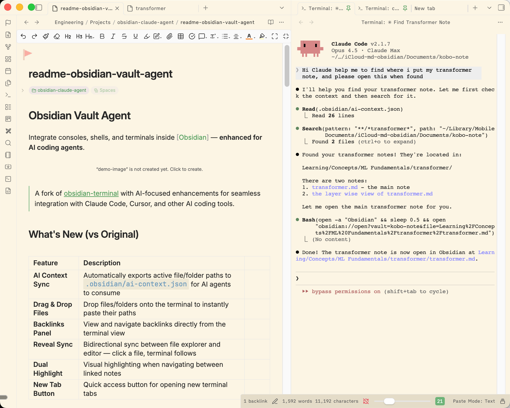
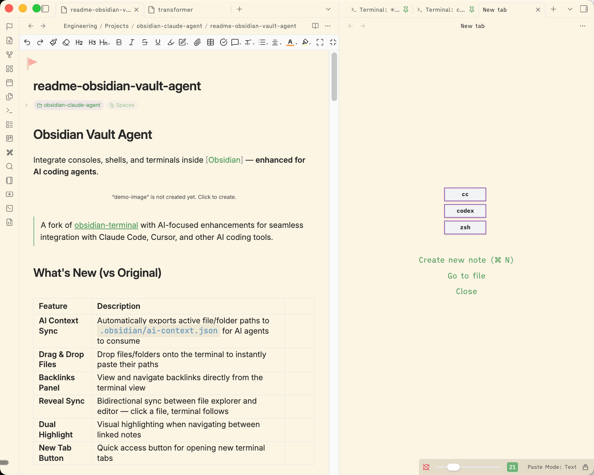

# 📖 Obsidian Vault Agent

[Obsidian]: https://obsidian.md/
[Python]: https://python.org/downloads/
[changelog]: https://github.com/liuyixin-louis/obsidian-vault-agent/blob/main/CHANGELOG.md
[original]: https://github.com/polyipseity/obsidian-terminal
[latest release]: https://github.com/liuyixin-louis/obsidian-vault-agent/releases/latest

Integrate consoles, shells, and terminals inside [Obsidian] — **enhanced for AI coding agents**.



## What's New (vs Original)

| Feature | Description |
|---------|-------------|
| **AI Context Sync** | Automatically exports active file/folder paths to `.obsidian/ai-context.json` for AI agents to consume |
| **Drag & Drop Files** | Drop files/folders onto the terminal to instantly paste their paths |
| **Backlinks Panel** | View and navigate backlinks directly from the terminal view |
| **Reveal Sync** | Bidirectional sync between file explorer and editor — click a file, terminal follows |
| **Dual Highlight** | Visual highlighting when navigating between linked notes |
| **New Tab Button** | Quick access button for opening new terminal tabs |

> A fork of [obsidian-terminal][original] with AI-focused enhancements for seamless integration with Claude Code, Cursor, and other AI coding tools.

__[Changelog] · [Features](#features) · [Installation](#installation) · [Usage](#usage) · [Contributing](#contributing)__

For first time users, read the [installation](#installation) section first!

## Agent-Aware Execution

Obsidian Vault Agent treats terminals as **execution surfaces for AI agents**, not just shells.

It provides lightweight but reliable primitives for synchronizing vault context, paths, and navigation state with external coding agents such as Claude Code and Cursor.

This allows agents to operate *inside* your workspace with awareness of notes, files, and structure — without introducing a separate chat-first UI.

## Features

- Start external terminals from Obsidian.
- Integrate terminals into Obsidian.
- Has an emulated developer console usable on all platforms.
- Supports multiple terminal profiles.
- Has built-in keyboard shortcuts.
- Automatically save and restore integrated terminal history.
- Find in terminal.
- Save terminal history as file.
- Customize terminal appearance.
- Push AI context + drag/drop helper files for agents.

## Why not X?

There are several excellent projects exploring AI + Obsidian, but **Obsidian Vault Agent** intentionally occupies a different layer of the stack.

- **[claudesidian](https://github.com/heyitsnoah/claudesidian)** is a curated Obsidian *vault template* and set of scripts for using Claude Code effectively. It focuses on PARA-style organization, bootstrap workflows, and maintenance utilities, but does not provide an Obsidian plugin, embedded UI, or runtime integration. Vault Agent, by contrast, is a first-class Obsidian plugin that embeds terminals and agent-aware execution directly into the editor.

- **[obsidian-agent-client](https://github.com/RAIT-09/obsidian-agent-client)** provides a chat-centric side panel for interacting with ACP-compatible agents such as Claude Code, Codex, and Gemini. Its primary abstraction is conversational AI. Vault Agent instead centers on **execution surfaces**: embedded terminals, file-system-aware commands, and vault-synchronized context, treating agents as operators acting *inside* your workspace rather than chat bots alongside it.

In short, Vault Agent is not a chat UI or a vault template. It is an **execution substrate** for running and contextualizing agents *inside* your Obsidian vault, tightly integrated with notes, paths, backlinks, and the local system.

If you are primarily looking for a chat-based AI assistant inside Obsidian, other plugins may be a better fit. Vault Agent is for those who want agents to *execute* in their workspace, not just converse.

## Installation

1. Install plugin.
    - Manual
        1. Create directory `terminal-ai` under `.obsidian/plugins` of your vault.
        2. Place `manifest.json`, `main.js`, and `styles.css` from the [latest release] into the directory.
    - Building (from source)
        1. Clone this repository, including its submodules.
        2. Install [npm](https://docs.npmjs.com/downloading-and-installing-node-js-and-npm).
        3. Run `npm install` in the root directory.
        4. Run `npm run obsidian:install <vault directory>` in the root directory.
    - [Obsidian42 - BRAT](https://obsidian.md/plugins?id=obsidian42-brat)
        - Add `liuyixin-louis/obsidian-vault-agent` as a beta plugin.
        - See [BRAT readme](https://github.com/TfTHacker/obsidian42-brat#readme) for details.
2. (optional for Windows, recommended) Install Python and dependencies.
    1. Install [Python] 3.10/+.
    2. (Windows only) Run `pip3 install psutil==5.9.5 pywinctl==0.0.50 typing_extensions==4.7.1`. <!-- Update `README.md`, `magic.ts`, and `requirements.txt` together. -->
    3. Configure Python executable in profile settings. Press the "Check" button to validate the Python configuration. Each profile needs to be configured separately.
3. Enable plugin.
4. (optional) Configure plugin settings.

## Usage

- To start a new external or integrated terminal
  - Ribbon
      1. Click on the `Open terminal` ribbon.
      2. Choose the desired profile.
  - Context menu
      1. Right-click on files, folders, or tab headers.
      2. Choose the desired action \(and profile\).
  - Command palette
      1. Press `Ctrl`+`P` or click on the `Open command palette` ribbon next to the left window border.
      2. Choose the desired action \(and profile\).
  - Select profile modal
      1. Choose the desired profile. Press `Ctrl` to edit the profile before use. The item `(Temporary profile)` starts a terminal with a temporary profile.
- To save and restore integrated terminal history
    1. Keep the terminal open when exiting Obsidian.
    2. Terminal history will be restored next time Obsidian is opened.
- Additional actions
  - Includes
    - Clear terminal: \(1\), \(4\)
    - Copy terminal: \(1\)
    - Edit terminal: \(1\)
    - Export, import, or edit settings: \(2\), \(3\)
    - Find in terminal: \(1\), \(4\)
    - Open documentation: \(2\), \(3\)
    - Restart terminal: \(1\)
    - Save terminal history: \(1\)
  - Available by
    - \(1\) Right-click on tab header/`More options`
    - \(2\) Open settings
    - \(3\) Open command palette
    - \(4\) Use keyboard shortcuts

## AI Integration

- Context push: active file/folder changes are debounced and saved to `.obsidian/ai-context.json` with vault + system paths and `updatedAt`.
- Drag & drop: dropping files/folders onto the terminal pastes their paths into the terminal.
- Both helpers use the vault root from the Obsidian file system adapter; when no changes are detected, files are not rewritten.

<!-- entry point of both claude code and codex agent -->
<!-- /Users/yixinliu/workspace/kobo-note-agent-terminal/obsidian-terminal/assets/entry-buttons.png -->
### Entry points  




### Keyboard shortcuts

The keyboard shortcuts can be customized in hotkeys settings.

<!-- markdownlint-disable-next-line MD036 -->
__Global__

- Toggle focus on last terminal: `Ctrl`+`Shift`+`` ` ``
  - Focus on last terminal: \(unbound; useful if you want separate keys for focus and unfocus\)

<!-- markdownlint-disable-next-line MD036 -->
__Terminal is focused__

When a terminal is focused, other keyboard shortcuts \(including Obsidian and plugin hotkeys\) are disabled. Only the following keyboard shortcuts work. Thus you can ignore Obsidian complaining about conflicting keys for the following keyboard shortcuts.

- Clear terminal: `Ctrl`+`Shift`+`K`, `Command`+`Shift`+`K` \(Apple\)
- Close terminal: `Ctrl`+`Shift`+`W`, `Command`+`Shift`+`W` \(Apple\)
- Find in terminal: `Ctrl`+`Shift`+`F`, `Command`+`Shift`+`F` \(Apple\)
- Toggle focus on last terminal: `Ctrl`+`Shift`+`` ` `` \(same as above\)
  - Unfocus terminal: \(unbound; useful if you want separate keys for focus and unfocus\)

### Theming

Theming is possible. However, there is no user-friendly interface for now.

1. Open the profile editing modal.
2. Click on the `Edit` button labeled `Data`. It should open up a new modal in which there is a large textbox.
3. Notice `terminalOptions` in the text area labeled `Data`. Refer to the [`xterm.js` documentation](https://github.com/xtermjs/xterm.js/blob/master/typings/xterm.d.ts#L26) (`ITerminalOptions`) to set the options. Nested objects may need to be used.
4. Save the profile. Changes should apply immediately.

### Profiles

This plugin comes with several profile presets that you can reference.

When setting up a terminal profile, you need to distinguish between shells and terminal emulators. (Search online if needed.) Generally, integrated profiles only work with shells while external ones only work with terminal emulators.

#### Examples

<!-- markdownlint-disable-next-line MD036 -->
__Shells__

- Bash: `bash`
- Bourne shell: `sh`
- Command Prompt: `cmd`
- Dash: `dash`
- Git Bash: `<Git installation>\bin\bash.exe` (e.g. `C:\Program Files\Git\bin\bash.exe`)
- PowerShell Core: `pwsh`
- Windows PowerShell: `powershell`
- Windows Subsystem for Linux: `wsl` or `wsl -d <distribution name>`
- Z shell: `zsh`

<!-- markdownlint-disable-next-line MD036 -->
__Terminal emulators__

- Command Prompt: `cmd`
- GNOME Terminal: `gnome-terminal`
- Konsole: `konsole`
- Terminal (macOS): `/System/Applications/Utilities/Terminal.app/Contents/macOS/Terminal "$PWD"`
- Windows Terminal: `wt`
- iTerm2: `/Applications/iTerm.app/Contents/MacOS/iTerm2 "$PWD"`
- xterm: `xterm`

### Miscellaneous

This plugin patches `require` so that `require("obsidian")` and other Obsidian modules work in the developer console. It is toggleable as `Expose internal modules` in settings.

In the developer console, a context variable `$$` is passed into the code, which can be used to dynamically change terminal options.

The full API is available from [`src/@types/obsidian-terminal.ts`](src/%40types/obsidian-terminal.ts).

### Troubleshooting

- Is the plugin useful on mobile?
  - Compared to on desktop, it is much less useful. The only use for it for now is opening a developer console on mobile.
- Why do hotkeys not work?
  - If the terminal is in focus, all Obsidian hotkeys are disabled so that you can type special characters into the terminal. You can unfocus the terminal by pressing `Ctrl`+`Shift`+`` ` ``, then you can use Obsidian hotkeys again.

## Contributing

Contributions are welcome!

This project uses [`changesets`](https://github.com/changesets/changesets) to manage the changelog. When creating a pull request, please [add a changeset](https://github.com/changesets/changesets/blob/main/docs/intro-to-using-changesets.md#adding-changesets) describing the changes. Add multiple changesets if your pull request changes several things. End each changeset with `([PR number](PR link) by [author username](author link))`. For example, the newly created file under the directory `.changeset` should look like:

```Markdown
---
"example": patch
---

This is an example change. ([GH#1](https://github.com/liuyixin-louis/obsidian-vault-agent/pull/1) by [@liuyixin-louis](https://github.com/liuyixin-louis))
```

### Todos

The todos here, ordered alphabetically, are things planned for the plugin. There are no guarantees that they will be completed. However, we are likely to accept contributions for them.

- Connect to remote shells.
- Detect sandboxed environment and notify users.
- External link confirmation.
- Filter console log by severity in the developer console.
- Indicate that the terminal resizer has crashed or is disabled.
- Shared terminal tabs.
- Vim mode switch.

### Translating

See [`assets/locales/README.md`](assets/locales/README.md).

## Security

We hope that there will never be any security vulnerabilities, but unfortunately it does happen. Please [report](#reporting-a-vulnerability) them!

### Supported versions

| Version  | Supported |
| -------- | --------- |
| rolling  | ✅        |
| latest   | ✅        |
| outdated | ❌        |

### Reporting a vulnerability

Please report a vulnerability by [opening a new issue](https://github.com/liuyixin-louis/obsidian-vault-agent/issues/new). We will get back to you as soon as possible.

---

> A fork of [obsidian-terminal][original] with AI-focused enhancements for seamless integration with Claude Code, Cursor, and other AI coding tools.

This fork is renamed (`id: terminal-ai`) to avoid conflicts with the official Terminal plugin.

Maintained by [Yixin Liu](https://github.com/liuyixin-louis).
